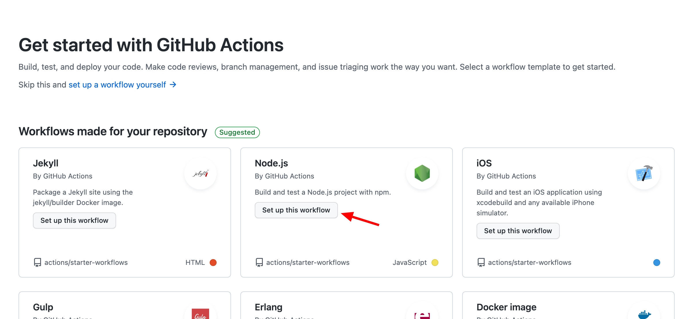

# Github Actions

---



---

<style scoped>

h2 {
    font-size: 60px;
}

li{
    font-size: 40px;
}

</style>

## Goals

- Workflow, Job, Step
- Share data between jobs
- Matrix 🕶️

---

## GHA simple configuration

```yml
name: Node.js CI

# CI should be runned on master branch and on PR targeting master
on:
  push:
    branches: [master]
  pull_request:
    branches: [master]

jobs: # Jobs are a group of steps
  build:
    runs-on: ubuntu-latest

    steps:
      - uses: actions/checkout@v2 # Actions are "packages" for GHA
      - uses: actions/setup-node@v2
        with: # Actions can have parameters
          node-version: 14.x
      - run: yarn lint # Use the "run:" to execute some bash command
      - run: yarn test
      - run: yarn build
```
